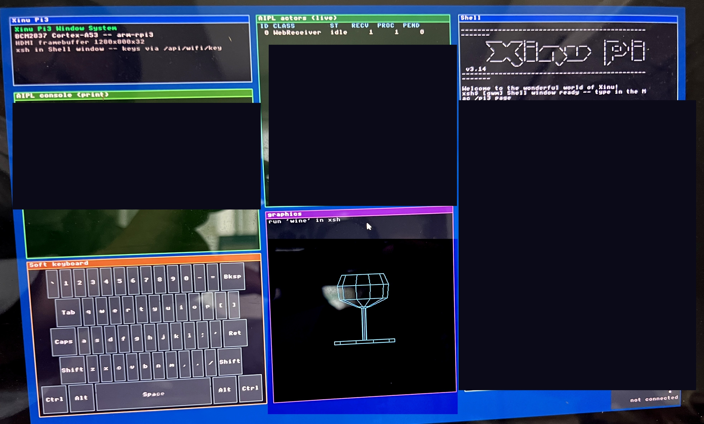

# xinu-rpi3 — Embedded Xinu on Raspberry Pi 3 B+

Fork of Embedded Xinu (Marquette University) targeting the
**Raspberry Pi 3 B+ (BCM2837, ARMv7-A Cortex-A53 in AArch32 mode)**
on real hardware.  Branch: `arm-rpi3-port`.

> Japanese-language developer log: see [`NEXT_SESSION.md`](NEXT_SESSION.md).
> The upstream Embedded Xinu README starts at section "Embedded Xinu" below.

*Embedded Xinu booted on a real Raspberry Pi 3 B+: HDMI window system with live
actor table, AIPL console, shell (`xsh`), soft keyboard, and a rotating 3D
wine-glass wireframe in the graphics window.*

## What works on this fork

Hardware bring-up:
- **HDMI framebuffer** + console
- **USB OTG** (DWC2) — keyboard, mouse
- **USB ethernet** (LAN78xx / LAN7515 onboard NIC) — ping ~3 ms, TCP bidirectional
- **WiFi** (BCM43455 over the Arasan SDIO) — scan, WPA2 join, DHCP, ARP/ICMP
- **HDMI window manager** (ported from Pi 5; interactive `xsh` + WiFi UI)
- **MMU** — ARMv7-A short-descriptor identity map, RAM vs MMIO region attributes
  enforced (Normal cacheable RAM, Device strongly-ordered MMIO, MMIO no-execute)

Runtime + observability:
- **AIPL actor runtime** — `Fork`, `Philosopher` (dining demo), `WebReceiver`,
  plus a `Dispatcher` + 4 `Worker` load balancer
- **Lock-free MPSC mailbox** — stress-tested with 256 in-flight tasks, 0 drops
- **HTTP server on port 8080** with 20+ routes for introspection and control
  (`/api/actors`, `/api/threads`, `/api/memstat`, `/api/mmu`, `/api/loadbal/*`,
  `/gc`, `/mmio-read`, `/compile`, `/upload`, `/kexec`, `/reboot`, …)
- **AIPL-RPC server on port 5555** — Mac-side tooling can `SPAWN` / `COMPILE`
  AIPL programs at runtime

C JIT (`apps/cc_mvp.c`):
- Compiles a Turing-complete C subset to native **ARM32 (AArch32) machine code**
  and executes it in-place out of an identity-mapped RAM page
- Supports: locals, `+ - == != < > <= >= = if / else while return`, function
  calls into a builtin symbol table (`print_int`, `actor_count`, `actor_age`,
  `now_ms`, …)
- Verified on hardware: `int main() { int s=0; int i=1; while (i<=10) { s=s+i; i=i+1; } return s; }`
  → returns 55 from a 140-byte ARM32 code blob the kernel emitted at runtime

Network-only kernel update (no SD swap):
- `POST /upload` — receive a kernel image into a 512 KB slot (chunked HTTP
  reader, ~11 s for the current 305 KB build at 26 KB/s)
- `POST /kexec` — disable MMU, copy uploaded image to `0x8000`, jump to it; the
  new kernel boots fresh and re-enables the MMU
- Volatile (a power cycle still reboots from SD), but the dev loop no longer
  needs the user to physically swap the SD card for each iteration

Performance work documented in commit history:
- `TCP_GRACIOUSACK` enabled + 4 KB chunked body reader → kills the O(n²)
  byte-at-a-time strstr pattern in the HTTP request parser
- `TCP_IBLEN` 16 KB → 65528 (set just under the `ushort` window cap — `65536`
  bricks because `tcpSendWindow` overflows to advertising window=0)
- End-to-end upload: 91 s → 11 s (~8× on 305 KB)

## HDMI desktop, WiFi & GC-backed N-Queens (this branch)

On top of the bring-up above, this branch adds an interactive on-screen
desktop, a WiFi stack with shell commands, and a GC-backed distributed
benchmark. Current build tag: `xinu-gwm-b69` (see `WIFI_BUILD_ID` in
`apps/wifi.c`).

**gwm window manager (HDMI, 1280×800)** — `apps/gwm.c` + `apps/gvideo.c`,
drawn over the framebuffer that `screenInit` set up. Windows:
- **Shell** — a *real* `xsh` bound to the `GWINCON0` software console:
  command output, `ls`, `ps`, `cat`, `wifi`, … all run and print here.
  stdin is injected over HTTP (`/api/wifi/key`); stdout/stderr render via
  the window's text ring.
- **graphics** — a wire-frame 3-D wine glass that tumbles on the X/Y/Z
  axes; started on demand by the `wine` shell command (30 turns, then
  idle so it does not steal CPU from the network responder).
- **AIPL actors / AIPL console / Soft keyboard / Info** — live monitors.
- **WiFi indicator** (bottom-right): white = not connected, green = up,
  with the joined SSID printed underneath.

**WiFi (BCM43455 over SDIO)** — scan / WPA2 join / DHCP / ARP+ICMP. Shell
commands:
- `wifi status` — connection state (SSID + IP/GW)
- `wifi on` — scan, list candidate APs, pick one by number, enter the
  password, connect (join + DHCP)
- `wifi off` — disconnect
- `wifi-invest` — when "connected but ping fails", restart the responder,
  send gratuitous ARP, and retry the gateway probe until it works (then
  auto-finish), or print the most likely reason

**Distributed N-Queens with actor GC** — the `Dispatcher` + 4 `Worker`
load balancer solves N-Queens split by first column (one `compute_nq`
task per column). A `Collector` actor sweeps idle actors periodically
(`/api/gc-actor/*`). Results are **push-aggregated**: workers push `done`
to the Dispatcher, which sums the partial counts, so the client reads one
running total from `/api/loadbal/nqueens-result` instead of polling every
task. Verified: n=8 → 92, n=9 → 352.

**Mac dashboard** — `src/python-aipl/aipl_dashboard.py` (`--dashboard 8899`)
serves `/pi3`, a browser mirror of the gwm desktop: the Shell window
mirrors the real `xsh` ring, keystrokes are proxied to the Pi 3, and the
WiFi widget scans / connects / shows status. See the Japanese user guide
in `docs/USERS-GUIDE-JA.md`.

> Note: `webactor` is single-threaded, so heavy on-CPU work (a WiFi scan,
> a continuous animation, or a big N-Queens run) briefly starves the HTTP
> control plane. Animations are therefore on-demand and bounded.

## Quick start

Build:

    cd compile
    make PLATFORM=arm-rpi3
    # produces ./xinu.boot (~305 KB)

    # If you changed a shared header (e.g. include/thread.h), libxc is NOT
    # rebuilt by `make clean` — force it or printf-to-device silently breaks:
    #   rm -f lib/libxc/*.o lib/libxc.a && make PLATFORM=arm-rpi3

Deploy A — over the network (Pi 3 must already be running a `/kexec`-capable
build):

    curl --data-binary @xinu.boot \
        "http://192.168.3.50:8080/upload?dst=xinu.boot"
    curl -X POST http://192.168.3.50:8080/kexec
    sleep 25
    curl http://192.168.3.50:8080/api/mmu   # should respond if the new
                                             # kernel booted cleanly

Deploy B — physical SD swap (initial bootstrap, or recovery after a bricked
`/kexec`):

    # eject SD from Pi 3, plug into Mac, /Volumes/XINU appears
    cp xinu.boot /Volumes/XINU/kernel.img
    sync && diskutil eject /Volumes/XINU
    # back into Pi 3, power on

Backup kernels (in case a deploy bricks):

    /Users/kodamay/tftpboot/kernel.img.pre-mmu-bak    # MMU off, oldest safe
    /Users/kodamay/tftpboot/kernel.img.pre-kexec-bak  # MMU on, no /kexec
    /Users/kodamay/tftpboot/kernel.img                # current build

## A few useful HTTP routes

    GET  /api/mmu                          MMU SCTLR / TTBR0
    GET  /api/actors                       AIPL actor inventory
    GET  /api/threads                      kernel thread table
    GET  /api/memstat                      free memory
    GET  /api/loadbal/stats                dispatcher + worker counters
    POST /api/loadbal/submit?n=K&ms=M      K sleep tasks of M ms each
    POST /api/loadbal/jit?n=K&prog=P       K JIT tasks (compile + run)
    POST /compile                          body = C source; runs it via JIT
    POST /upload?dst=NAME                  body = bytes; lands in upload slot
    POST /kexec                            jump to last upload as new kernel
    POST /reboot                           watchdog reset (re-boot from SD)

    WiFi + desktop:
    GET  /api/wifi/scan                    scan APs (JSON; ~30 s, drops link)
    GET  /api/wifi/join?ssid=S&pass=P      WPA2 join
    GET  /api/wifi/dhcp                    DHCP lease
    GET  /api/wifi/key?c=N                 inject a keystroke into the Shell
    GET  /api/wifi/shellring               dump the Shell window text ring

    N-Queens + actor GC:
    GET  /api/loadbal/init                 spawn Dispatcher + 4 Workers
    GET  /api/gc-actor/init                spawn Collector
    GET  /api/gc-actor/enable?on=1         enable periodic sweeps
    GET  /api/gc-actor/stats               GC sweep counters
    GET  /api/loadbal/nqueens?n=N          submit an N-Queens job (push-agg)
    GET  /api/loadbal/nqueens-result       one-poll aggregated total

## Repository layout (fork-specific additions)

    apps/cc_mvp.c                            C JIT (Stage 5)
    apps/abcl_program.c                      AIPL runtime + Dispatcher/Worker/Collector
                                             classes + N-Queens push-aggregation
    apps/webactor.c                          HTTP server with the routes above
    apps/wifi.c                              BCM43455 WiFi driver + investigate
    apps/gwm.c / apps/gvideo.c               HDMI window manager + drawing prims
    device/gwincon/                          windowed-shell console (xsh I/O)
    shell/xsh_wifi.c / xsh_wifi_invest.c     wifi / wifi-invest commands
    shell/xsh_wine.c                         wine (3-D wire-frame) command
    docs/USERS-GUIDE-JA.md                   Japanese user guide
    docs/nqueens_bench_report.tex/.pdf       N-Queens + GC benchmark report
    apps/sd_block.c                          SD driver stub (doesn't yet work —
                                             needs SDHOST port; see Known limits)
    system/platforms/arm-rpi3/mmu.c          MMU enable/disable
    include/tcp.h                            TCP_IBLEN=65528, GRACIOUSACK enabled

Driver fixes documented in commit history (see also `NEXT_SESSION.md`):

    device/smsc9512/lan78xx.c / lan78xx.h    Pi 3 onboard NIC driver
    system/platforms/arm-rpi3/usb_dwc_hcd.c  fast bulk-NAK defer for ping RTT

## Known limits

- `/kexec` is volatile — a real power cycle still re-loads from SD
- D-cache and I-cache are intentionally disabled (`SCTLR.C=0`, `SCTLR.I=0`);
  Cortex-A53 needs a set/way invalidate sweep before enabling them and that
  is the next planned commit
- SD writeback (for a persistent network kernel update) needs an SDHOST port
  — BCM2837's default SD controller is SDHOST at 0x3F202000, not the EMMC at
  0x3F300000 that `apps/sd_block.c` currently targets
- Pi 3 firmware TFTP fallback boot is not enabled (would need OTP bit set
  on the SoC), so kernel deploys without an existing `/kexec`-capable kernel
  on SD still need a physical SD swap
- `telnetd` on port 23 has an unsolved bug where child shell commands' output
  is intermittently lost (the shell thread's own output works); see
  `NEXT_SESSION.md` for the trace evidence

## License

Same as upstream Embedded Xinu — see `LICENSE`.

---

# Embedded Xinu #

Embedded Xinu, Copyright (C) 2008, 2009, 2010.  All rights reserved.

Version: 2.01

 1. What is Embedded Xinu?
 2. Directory Structure
 3. Prerequisites
 4. Installation Instructions
    1. Build Embedded Xinu
    2. Make serial and network connections
    3. Enter Common Firmware Environment prompt
    4. Set IP address
    5. Load image over TFTP
 5. Links

## 1. What is Embedded Xinu? ##

Xinu ("Xinu is not unix", a recursive acronym) is a UNIX-like operating
system originally developed by Douglas Comer for instructional purposes at
Purdue University in the 1980s.

Embedded Xinu is a reimplementation of the original Xinu operating system
on the MIPS processor which is able to run on inexpensive wireless routers
and is suitable for courses and research in the areas of Operating Systems,
Hardware Systems, Embedded Systems, Networking, and Compilers.

## 2. Directory Structure ##

Once you have downloaded and extracted the xinu tarball, you will see a
basic directory structure:

	AUTHORS   device/   lib/     mem/      loader/   README  system/
	compile/  include/  LICENSE  mailbox/  network/  shell/  test/

 * `AUTHORS`  a brief history of contributors to the Xinu operating system
              in it's varying iterations.
 * `compile/` contains the Makefile and other necessities for building the
              Xinu system once you have a cross-compiler.
 * `device/`  contains directories with source for all device drivers in Xinu.
 * `include/` contains all the header files used by Xinu.
 * `lib/`     contains library folders (e.g., `libxc/`) with a Makefile and 
              source for the library
 * `LICENSE`  the license under which this project falls.
 * `loader/`  contains assembly files and is where the bootloader will begin
              execution of O/S code.
 * `mailbox/` contains source for the mailbox message queuing system.
 * `mem/`     contains source for page-based memory protection.
 * `network/` contains code for the TCP/IP networking stack.
 * `README`   this document.
 * `RELEASE`  release notes for the current version.
 * `shell/`   contains the source for all Xinu shell related functions.
 * `system/`  contains the source for all Xinu system functions such as the
              nulluser process (`initialize.c`) as well as code to set up a C
              environment (`startup.S`).
 * `test/`    contains a number of testcases (which can be run using the shell
              command `testsuite`).

## 3. Prerequisites ##

### 3.1 Supported platform with hardware modification ###

To run Embedded Xinu you need a supported router or virtual machine.
Currently, Embedded Xinu supports Linksys WRT54GL, Linksys WRT160NL,
and the Qemu-mipsel virtual machine.  For an updated list
of supported platforms, visit:

https://xinu.cs.mu.edu/index.php/List_of_supported_platforms

In order to communicate with the router, you need to perform a hardware
modification that will expose the serial port that exists on the PCB.  For
more information on this process, see:

https://xinu.cs.mu.edu/index.php/Modify_the_Linksys_hardware

### 3.2 Cross-compiler ###

To build Embedded Xinu you will need a cross-compiler from your host
computer's architecture to MIPSEL (little endian MIPS for the 54GL router)
or MIPS (big endian for the 160NL router).  Instructions on how to do this
can be found here:

https://xinu.cs.mu.edu/index.php/Build_Xinu#Cross-Compiler

### 3.3 Serial communication software ###

Any serial communication software will do. The Xinu Console Tools include
a program called tty-connect which can serve the purpose for a UNIX 
environment.  More information about the Xinu Console Tools can be found 
at:

https://xinu.cs.mu.edu/index.php/Console_Tools#Xinu_Console_Tools

### 3.4 TFTP server software ###

A TFTP server will provide the router with the ability to download and run
the compiled Embedded Xinu image.  

## 4. Installation Instructions ##

### 4.1 Build Embedded Xinu ###

Update the `MIPS_ROOT` and `MIPS_PREFIX` variables in compile/mipsVars to 
correctly point to the cross-compiler on your machine.

Then, from the compile directory, simply run make, which should leave you
with a xinu.boot file.  This is the binary image you need to transfer to
your router for it to run Embedded Xinu.  The default build is for the
WRT54GL router; change the compile/Makefile `PLATFORM` variable for other
builds.  See the compile/platforms directory for supported configurations.

### 4.2 Make serial and network connections ###

After creating the `xinu.boot` image you can connect the router's serial
port to your computer and open up a connection using the following
settings:

 - 8 data bits, no parity bit, and 1 stop bit (8N1)
 - 115200 bps

### 4.3 Enter Common Firmware Environment prompt ###

With the serial connection open, power on the router and immediately start
sending breaks (Control-C) to the device, if your luck holds you will be
greeted with a CFE prompt.

    CFE>

If the router seems to start booting up, you can powercycle and try again.

### 4.4 Set IP address ###

By default, the router will have a static IP address of 192.168.1.1.  If you
need to set a different address for your network, run one of the following
commands:

    ifconfig eth0 -auto                      if you are using a DHCP server 
    ifconfig eth0 -addr=*.*.*.*              for a static IP address

### 4.5 Load image over TFTP ###

On a computer that is network accessible from the router, start your TFTP
server and place the xinu.boot image in the root directory that the server
makes available.

Then, on the router type the command:

    CFE> boot -elf [TFTP server IP]:xinu.boot

If all has gone correctly the router you will be greeted with the Xinu Shell
(`xsh$ `), which means you are now running Embedded Xinu!

## 5. Links ##

### The Embedded Xinu Wiki ###

The home of the Embedded Xinu project

    https://xinu.cs.mu.edu/index.php/

### Dr. Brylow's Embedded Xinu Lab Infrastructure Page ###

More information about the Embedded Xinu Lab at Marquette University

    http://www.mscs.mu.edu/~brylow/xinu/

